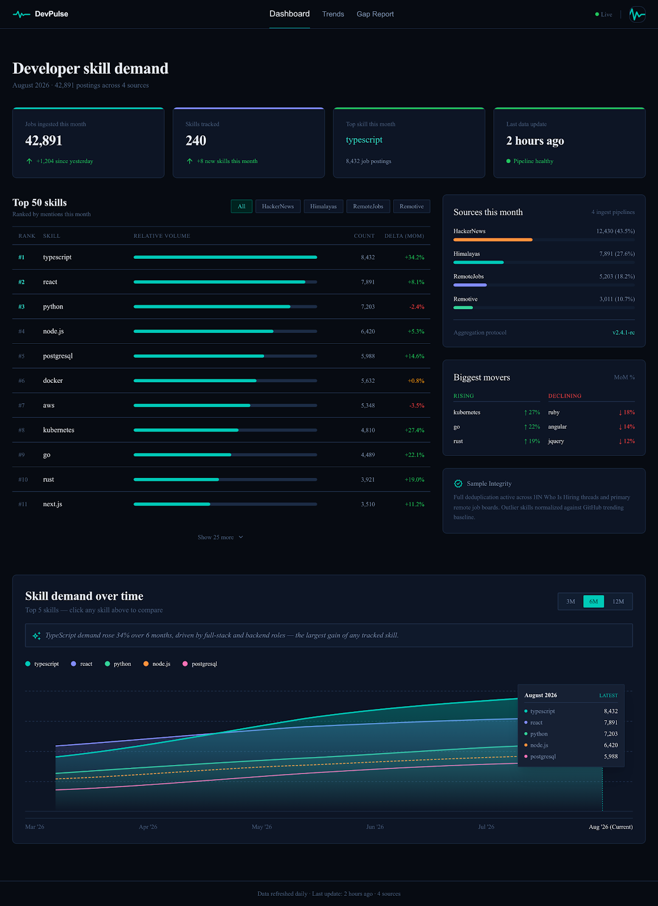

# DevPulse: Real-time Developer Job Market Intelligence

> Live skill demand, gap analysis, and personalized job matching for remote developers targeting US companies. Ingests 10 job sources daily, scores every posting against your own skills, and turns a gap report into the start of a learning session with timestamped YouTube chapters.

<!-- Add a dashboard screenshot here, e.g.  -->

DevPulse answers questions most developers answer on gut feel: *"Is TypeScript demand actually rising?"*, *"Which of these 40 postings actually fit what I know?"*, *"What should I learn next?"* It answers them with **live data, deterministic scoring, and grounded AI prose**. Every number traces back to a real Supabase row.

Full product spec (data model, pipeline steps, AI grounding rules, security rules): [`AGENTS.md`](./AGENTS.md).

---

## Why it exists

Remote developers, especially in Africa, LATAM, and Eastern Europe targeting US-remote roles, make skill and CV decisions on outdated signals. DevPulse replaces that with:

- **Live ingestion** of real postings from 10 sources every day, with skill mentions tracked month over month.
- **A persistent profile** via Supabase Auth (magic link), so market data, gap history, and GitHub-synced skills compound over time.
- **Demand-weighted scoring** in `lib/matching.ts`. `marketAlignmentPct` and `stackMatchPct` are plain arithmetic over `skill_demand_snapshots`, never AI-generated.
- **Grounded AI synthesis.** AI only narrates numbers that were already computed. It never invents a statistic (enforced by system prompt and Zod validation in `app/api/gap-report/route.ts`).

---

## Features

### Four things it does well

1. **Skill Gap Report.** Enter a role and your skills. `POST /api/gap-report` computes market alignment against this month's Top 50, splits strengths from gaps, derives rising/declining skills from two months of history, and asks AI only for three numbered recommendations.
2. **Tutorial search, chapter-first.** Each gap skill expands into ranked tutorial cards with exact jump points. Stage 1 is a pgvector cosine search over human-authored YouTube chapter labels. Stage 2 falls back to ~60s transcript chunks, only for videos with no accepted chapters. Clicking a card opens an inline embed at the right timestamp.
3. **Live job feed with Stack Match.** Every card shows how much of the posting's stack you cover, plus an orange `!gap` chip for skills you've declared as gaps. Missing data is shown honestly: `"Not disclosed"` for comp, `"Not enough data"` instead of a fake `0%`.
4. **Auto-Git Sync.** A weekly cron reads your public GitHub repos (languages and topics), normalizes them through the skill dictionary, and upserts them into your profile. Skills you added manually always win.

### Pages

| Page | Route | What it shows |
|------|-------|---------------|
| Dashboard | `/` | Stat cards, Top 50 skills with month-over-month delta, source breakdown, biggest movers, 12-month trend chart with an AI one-liner |
| Trends | `/trends` | Compare up to 5 skills over 3M / 6M / 12M with per-skill stats and an AI trend summary |
| Jobs | `/jobs` | Searchable, filterable feed sorted by profile match, recency, or comp; detail panel with an AI-restructured About / Role / Requirements |
| Skills | `/skills` | Target role and seniority, dictionary-validated skill tags, quick-add chips from live demand; submits to the gap report |
| Gap Report | `/gap-report` | Alignment score, strengths, skills to consider (with tutorials and lesson notes), rising/declining, recommendations |
| Profile | `/profile` | Identity and GitHub handle, career target, core skill stack, source toggles, alert preferences, API key and JSON export |
| Sign-in | `/sign-in` | Passwordless magic link (no password field, by design) |

Desktop layout is exact at 1280px (reference images in `design/`). There is no mobile reference: columns stack and the nav collapses to a burger.

---

## How it works

### Security invariant

> **The browser never holds API keys.** It never calls the AI provider, the ingestion/indexing/sync/dispatch jobs, the YouTube Data API, the GitHub API, or Resend directly. All of that lives in Next.js API routes or Vercel Cron. Only `NEXT_PUBLIC_SUPABASE_URL` and `NEXT_PUBLIC_SUPABASE_ANON_KEY` are public. YouTube thumbnail and embed URLs are the only direct browser references (public endpoints, no key).

### Architecture

| Layer | Responsibility |
|-------|----------------|
| Browser | Renders UI, carries the Supabase session cookie, calls safe `app/api/*` routes, embeds YouTube directly |
| Next.js API routes | Validate the session server-side (`supabase.auth.getUser()`, 401 on miss) or a hashed bearer key for `/api/export`; call the AI SDK and Supabase; return safe JSON |
| Vercel Cron | Daily ingest, weekly tutorial index, weekly GitHub sync, alert dispatch, all guarded by a `CRON_SECRET` bearer check |
| Supabase | Auth (magic link), Postgres + `pgvector`, RLS (`auth.uid() = user_id`) as a second layer behind the API checks |
| Vercel AI SDK | Provider-agnostic generation and embeddings, switched with `AI_PROVIDER` / `AI_MODEL` / `AI_MODEL_EMBEDDING` |
| Resend | Three product alert emails (server-only; separate from Supabase's magic-link email) |
| Octokit | Public repo reads for GitHub sync (server-only, single PAT) |

**Auth flow:** email, then Supabase sends a magic link, then the `@supabase/ssr` cookie session is set. `proxy.ts` and `app/(app)/layout.tsx` guard the pages, and the `on_auth_user_created` trigger creates the `profiles` row.

### Data sources

**Jobs (10):** HackerNews "Who is Hiring" (via Algolia, the only source with a multi-year archive, which is what makes trends possible), Himalayas, RemoteJobs.org, Remotive, Arbeitnow, RemoteOK, Jobicy, Adzuna (`us`, `gb` only), Jooble, The Muse.

**Supporting:** YouTube Data API v3 (tutorial indexer only) and the GitHub REST API (sync only).

Per-source endpoints, auth, rate limits, and ToS notes (for example, Adzuna requires a "Jobs by Adzuna" badge and Jooble's key sits in the URL path, so never log it) are documented in [`AGENTS.md`](./AGENTS.md).

---

## Tech stack

- **Framework:** Next.js (App Router, `proxy.ts` auth, `vercel.json` crons), React, TypeScript (`strict`, no `any`)
- **UI:** Tailwind CSS v4, shadcn/ui, charts via the shadcn wrapper over Recharts, Framer Motion for all animation (respects `prefers-reduced-motion`), Lucide icons
- **Data:** Supabase (Postgres, `pgvector`, Auth, RLS) via `@supabase/supabase-js` and `@supabase/ssr`. No ORM.
- **AI:** Vercel AI SDK with OpenAI, Anthropic, Google, Mistral, DeepSeek, OpenRouter, and Ollama supported. Zod validates every API input and structured AI output.
- **Services:** Resend (email), Octokit (GitHub), `youtube-transcript` (public captions, no OAuth)

Exact versions live in `package.json`. Not used: Prisma, per-user GitHub OAuth, password auth / NextAuth / Clerk, or scraping behind login walls.

---

## Getting started

### Prerequisites

- Node.js 20+ and `pnpm`
- A Supabase project with the `pgvector` extension and magic-link Auth enabled
- An API key for at least one AI provider

The YouTube, GitHub, and Resend keys are only needed for the features that use them (see [Environment](#environment)).

### Setup

```bash
git clone https://github.com/<you>/dev-pulse.git
cd dev-pulse
pnpm install

cp .env.example .env.local   # then fill in the required values below
```

Run the migrations in order (Supabase SQL editor or CLI): `supabase/migrations/001` through `008`. The first one enables the `vector` extension.

```bash
pnpm dev
# open http://localhost:3000 → redirected to /sign-in → enter email → click the magic link
```

### Populate data

Nothing shows until the first ingest has run. Trigger the crons manually:

```bash
curl -H "Authorization: Bearer $CRON_SECRET" http://localhost:3000/api/cron/ingest
curl -H "Authorization: Bearer $CRON_SECRET" http://localhost:3000/api/cron/tutorial-index
curl -H "Authorization: Bearer $CRON_SECRET" http://localhost:3000/api/cron/github-sync
```

Verify ingestion worked (expect `typescript`, `react`, `python`, `node.js` near the top):

```sql
select skill, mention_count from skill_demand_snapshots
where month = to_char(now(), 'YYYY-MM')
order by mention_count desc limit 20;
```

With no Supabase env at all, pages still render in demo mode and the dashboard shows a "No data yet" empty state.

### Environment

Only the two `NEXT_PUBLIC_*` variables are public. Everything else is server-only.

**Required**

| Variable | Purpose |
|----------|---------|
| `NEXT_PUBLIC_SUPABASE_URL`, `NEXT_PUBLIC_SUPABASE_ANON_KEY` | Public Supabase config (RLS-respecting anon key) |
| `SUPABASE_SERVICE_ROLE_KEY` | Bypasses RLS. Used only in `lib/supabase/service-role.ts` and `app/api/cron/*` |
| `AI_MODEL` | Generation model, e.g. `gpt-4o-mini`, `gemini-2.5-flash`, `claude-sonnet-4-5` |
| `AI_API_KEY` (or a provider-specific key) | Provider-specific aliases: `OPENAI_API_KEY`, `ANTHROPIC_API_KEY`, `GOOGLE_GENERATIVE_AI_API_KEY`, `MISTRAL_API_KEY`, `DEEPSEEK_API_KEY`, `OPENROUTER_API_KEY` |
| `CRON_SECRET` | Must match the Vercel Cron `Authorization` header on every `app/api/cron/*` route |
| `API_KEY_PEPPER` | Mixed into `sha256(raw + pepper)` for `/api/export` keys. Distinct from `CRON_SECRET`; rotating it invalidates all issued keys |

**Needed only for specific features**

| Variable | Feature |
|----------|---------|
| `AI_MODEL_EMBEDDING` | Tutorial search (e.g. `text-embedding-3-small`, `gemini-embedding-001`) |
| `YOUTUBE_API_KEY` | Tutorial indexing |
| `GITHUB_TOKEN` | GitHub sync (public-read PAT) |
| `RESEND_API_KEY` | Alert emails |

**Optional:** `AI_PROVIDER` (inferred from `AI_MODEL` or available keys if unset), `AI_BASE_URL` / `OLLAMA_BASE_URL` / `OPENAI_BASE_URL`, `SUPABASE_CONNECTION_URL`, `ADZUNA_APP_ID` + `ADZUNA_APP_KEY`, `JOOBLE_API_KEY`, `THEMUSE_API_KEY` (works keyless, but a free key raises the rate limit), `WEEKLY_INDEX_BUDGET` (max skills indexed per weekly run, default `40`).

**Switching AI providers is env-only:**

```bash
AI_PROVIDER=openai     AI_API_KEY=sk-…                AI_MODEL=gpt-4o-mini
AI_PROVIDER=google     GOOGLE_GENERATIVE_AI_API_KEY=… AI_MODEL=gemini-2.5-flash  AI_MODEL_EMBEDDING=gemini-embedding-001
AI_PROVIDER=anthropic  ANTHROPIC_API_KEY=…            AI_MODEL=claude-sonnet-4-5
AI_PROVIDER=ollama     AI_MODEL=llama3.1              OLLAMA_BASE_URL=http://localhost:11434/v1
```

Magic-link emails are configured in the Supabase Dashboard (SMTP / default sender), not through `RESEND_API_KEY`. Keep the two delivery paths independent.

---

## Project structure

```
app/
  (app)/                authenticated pages: dashboard, trends, jobs, skills, gap-report, profile
  sign-in/              magic-link form
  api/                  route handlers; api/cron/* are the only routes that use server-side keys
components/             UI grouped by page, plus shadcn primitives in ui/
lib/                    matching.ts, skills-dictionary.ts, ai/provider.ts, queries/, supabase/
supabase/migrations/    001–008, run in order
design/                 desktop reference images
prompts/                implementation prompts (traceability)
proxy.ts                auth gate
vercel.json             cron schedules
AGENTS.md               full product spec
```

---

## Pipelines

All offline. None are triggered by user requests, so Dashboard, Trends, Jobs, and Gap Report read precomputed rows.

| Cron route | Schedule (UTC) | What it does |
|------------|----------------|--------------|
| `/api/cron/ingest` | daily `0 6 * * *` | Fetches all 10 sources in parallel (one failure never blocks the rest), dedupes on `external_id`, extracts skills and best-effort comp/liquidity/contractor fields, upserts `job_postings`, `skill_mentions`, and monthly `skill_demand_snapshots` |
| `/api/cron/tutorial-index` | weekly `0 2 * * 0` | Ranks skills by recent gap demand, indexes the top `WEEKLY_INDEX_BUDGET` from YouTube (views > 10k, duration > 3 min), extracts chapters first (needs ≥3 ascending timestamps), then chunks transcripts, embeds both, and generates lesson notes |
| `/api/cron/github-sync` | weekly `0 4 * * 0` | For users with auto-sync on, reads public repos, normalizes through the dictionary (unknown languages dropped), and upserts `github_sync` skills without touching manual ones |
| `/api/cron/alert-dispatch` | daily `0 6 * * *` | Sends instant-match, weekly-digest, and learning-gap emails via Resend, deduped through `alert_dispatch_log` |

Every cron route returns 401 without `Authorization: Bearer $CRON_SECRET`.

### API keys and export

`POST /api/keys` generates a `dp_live_…` key, stores only `sha256(raw + API_KEY_PEPPER)` plus a masked prefix, and returns the raw key **once**. `GET /api/export` accepts that bearer key (not a session) and returns the caller's profile, skills, and saved jobs as read-only JSON. `POST /api/keys/revoke` invalidates a key immediately.

---

## Matching formulas

Both live in `lib/matching.ts`, are imported by the Jobs page and the Gap Report, and **never call AI**.

```ts
// Per job posting (Jobs page)
stackMatchPct = round(matchedDistinct / totalDistinct * 100)
// matchedDistinct = the job's distinct skills ∩ your skills
// totalDistinct   = distinct skills extracted for that job
// returns undefined ("Not enough data") when totalDistinct === 0

// Overall (Gap Report), weighted by demand
marketAlignmentPct = round(
  sum(mention_count for skills in yourSkills ∩ top50) / sum(mention_count over top50) * 100
)
// top50 = this month's skill_demand_snapshots by mention_count desc, limit 50
```

`computeRisingDeclining` computes month-over-month change as `(last - prev) / prev * 100`, treating `prev === 0` with `last > 0` as +100%.

### Skill dictionary

`lib/skills-dictionary.ts` is the single source of truth for canonical skills and aliases (`ts` → `typescript`, `k8s` → `kubernetes`, and so on). Ingestion, GitHub sync, Skills page validation, tutorial indexing, and both matching formulas all use it, so a skill you type reliably matches one extracted from a posting. Skills are stored lowercase, and anything not in the dictionary is discarded.

---

## API routes

All under `app/api/`, `runtime = "nodejs"`, Zod-validated. Profile-scoped routes call `supabase.auth.getUser()` server-side and return 401 before touching the database.

| Area | Routes | Auth |
|------|--------|------|
| Analysis | `POST /api/gap-report`, `POST /api/tutorial-search`, `GET /api/tutorial-lessons/[video_id]` | Session |
| Jobs | `GET /api/jobs`, `GET /api/jobs/stats` | Public (personalized when signed in) |
| Jobs | `GET /api/jobs/[id]/summary` (AI restructure, cached) | Session |
| Trends | `GET /api/trends` | Public |
| Trends | `GET/POST /api/trends-summary` | Public read / session generate |
| Profile | `/api/profile`, `/api/profile/skills`, `/api/alert-preferences`, `/api/saved-jobs` | Session |
| Keys | `POST /api/keys`, `POST /api/keys/revoke` | Session |
| Export | `GET /api/export` | Hashed bearer `dp_live_…` only, never a session |
| Auth | `GET /api/auth/callback` | Magic-link code |
| Cron | `/api/cron/*` | `CRON_SECRET` bearer |
| Debug | `/api/debug/*` | Debug only; disable in production |

---

## Development

| Command | What it does |
|---------|--------------|
| `pnpm dev` | Dev server |
| `pnpm build` | Production build (run whenever a route or server component changes) |
| `pnpm lint` | ESLint |
| `pnpm exec tsc --noEmit` | Strict typecheck (zero errors required) |

Before every PR, run the security gate in `AGENTS.md` §18. It greps for leaked keys in client code, confirms each server-only integration is referenced from only its one allowed route, and runs the RLS and auth checks (for example, that `select * from user_skills where user_id != auth.uid()` returns 0 rows for a signed-in user).

---

## Contributing

Follow `AGENTS.md` §4: **PLAN → APPROVE → BUILD → CHECK → REPORT**.

1. Read `AGENTS.md`, especially §2 (the browser never holds keys) and §3 (identity model).
2. Read the relevant skills (`vercel/next.js`, `vercel/ai`, `supabase`, `secure-coding`, `shadcn/ui`, …). Skills override memory.
3. Inspect 2–3 similar files and check `codegraph` for callers before editing.
4. Write an implementation prompt in `prompts/` and wait for approval before building.
5. Run all checks (typecheck, lint, build, security gate, DB sanity queries) and report real output.
6. Close with *What I did / Test / Needs your attention*.

Conventions: strict TypeScript with no `any`, Zod on all external input, deterministic matching in `lib/matching.ts` only, Framer Motion (not GSAP), honest `"Not disclosed"` / `"Not enough data"` gaps, and one `SKILLS_DICTIONARY`.

---

## License

MIT. Copyright (c) 2026 DevPulse (prg-04). See [`LICENSE`](./LICENSE).

*Built for remote developers who want data, not vibes. Data refreshed daily · 10 sources.*
